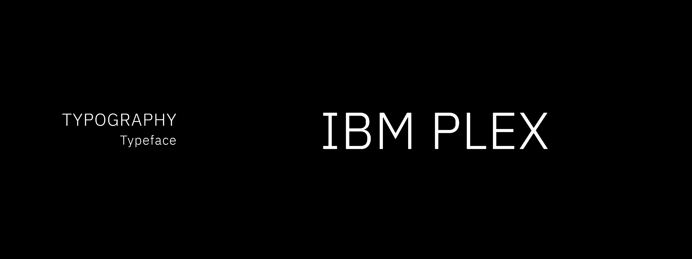

# Typeface

**IBM Plex® across all contexts.**

IBM Plex provides structural completeness without stylistic imposition. The family includes Sans, Serif, Mono, Math, and additional variants with shared proportions, enabling semantic differentiation while maintaining typographic coherence.

**Plex Sans:** Interface elements, headings, structured content, interactive components  
**Plex Serif:** Long-form prose, sustained reading contexts, article bodies  
**Plex Mono:** Code, technical notation, tabular data, fixed-width symbolic systems  
**Plex Math:** Mathematical equations, scientific notation, academic content

The typeface remains neutral—it encodes hierarchy and differentiates content types without adding interpretive voice. Design and editorial content share the same typographic foundation.

[**IMAGE 1:** IBM Plex Sans, Serif, and Mono specimens side by side showing shared proportions. Caption: "IBM Plex family: Sans, Serif, Mono—structural coherence across variants"]

## Typeface features

IBM Plex includes functional typographic features accessible through OpenType:

**Ligatures** (Sans and Serif): Ligatures resolve character collision and improve reading flow—fi, fl, ff, ffi, ffl. Use when typographically necessary, not decoratively.

**Fractions:** Diagonal fractions (½, ¾) for mathematical and measurement contexts. Prefer proper fraction glyphs over constructed alternatives.

**Alternate glyphs:** Contextual alternates improve specific character combinations. Use when they enhance legibility, not for stylistic variation.

**Currency symbols:** Global currency support (€, £, ¥, ₹, ₽, ₿, etc.) maintains consistent weight and proportion across the character set.

**Arrows:** Directional indicators (→, ←, ↑, ↓, ↔) for navigation, flow diagrams, and reference notation.

These features serve functional necessity. If a feature does not improve clarity or reduce ambiguity, it is not used.

[**IMAGE 2:** Ligature examples (fi, fl, ffi, ffl), fraction examples (1/2, 3/4), currency symbols, and arrows. Caption: "OpenType features: Functional typography, not decoration"]

## Mono versus Sans

IBM Plex Mono is designed with fixed 600-unit character width—a constraint inherited from typewriter mechanics. Monospaced type is not an aesthetic choice; it is required for representing code, data tables, and any context where character alignment encodes meaning.

Use Mono when:

- Displaying code or syntax
- Representing tabular data where column alignment matters
- Showing terminal output or command-line interfaces
- Character position itself carries semantic information

Use Sans or Serif for all other contexts. Monospace reduces reading efficiency in continuous prose—use it only where structure demands it.

[**IMAGE 3:** Side-by-side comparison showing same text in Plex Sans and Plex Mono, demonstrating character width consistency in Mono. Caption: "Mono vs Sans: Fixed character width for code and data alignment"]

## IBM Plex Math

IBM Plex Math includes over 5,000 glyphs covering mathematical symbols: alphanumeric characters, double-struck letters, Fraktur, operators, script variants, Greek letters, phonetics, and technical/geometric shapes. It is one of the most complete mathematical typefaces available.

Plex Math is designed with compatibility to IBM Plex Serif Regular, ensuring visual consistency when mathematical notation appears within prose. Use Plex Math for:

- Mathematical equations and formulas
- Scientific notation and academic papers
- Technical documentation requiring symbolic notation
- Any context where mathematical operators and special characters are needed

**Technical requirement:** Plex Math must be used with LaTeX or equivalent mathematical typesetting software. It provides an alternative to STIX and Cambria Math while maintaining structural consistency with the broader Plex family.

[**IMAGE 4:** Mathematical equation typeset in Plex Math showing integration, Greek letters, operators. Caption: "IBM Plex Math: Comprehensive mathematical notation support"]

### Language support

IBM Plex supports over 100 languages with extended Latin coverage, including Vietnamese. Non-Latin scripts include Arabic, Chinese (Traditional and Simplified), Cyrillic, Devanagari, Greek, Hebrew, Japanese, Korean, and Thai.

Language coverage ensures typographic consistency across global content. All scripts maintain the structural principles established in Latin variants—hierarchy through scale and weight, rhythm through spacing, differentiation through typographic variation.

---

# Type basics

Typography encodes structure through measurable relationships. These operational rules govern spacing, alignment, case, and punctuation—elements that determine reading quality and structural legibility.

### Tracking (letter-spacing)

IBM Plex is designed with built-in spacing that should not be modified. The typeface requires openness to maintain legibility—tight tracking reduces readability and contradicts the typeface's optical design.

**Default tracking:** 0 (use typeface's inherent spacing)  
**Headings:** 0 to slight negative tracking (-0.01em maximum) only at very large sizes (>60px)  
**Never:** Positive tracking for body text, extreme negative tracking, or tracking as decorative spacing

Plex appears lighter and more legible when given appropriate space. Do not compress it.

[**IMAGE 5:** Three examples showing comfortable spacing (correct), too-tight spacing (incorrect), and too-loose spacing (incorrect). Caption: "Tracking: Use Plex's designed spacing"]

### Alignment

**Flush left** for all text contexts. Left alignment creates strong vertical edges that guide reading, maintain organizational clarity, and support sustained cognition.

- **Body text:** Always flush left
- **Headings:** Flush left, aligned with body text
- **Captions and annotations:** Flush left
- **Lists:** Flush left
- **Never:** Right-aligned text, center-aligned paragraphs, or justified text

Right alignment, centered text, and justification introduce reading friction. Justified text creates uneven word spacing that disrupts reading rhythm. Center alignment weakens structural edges and reduces scanability.

[**IMAGE 6:** Four examples showing flush left (correct), right-aligned (incorrect), centered (incorrect), and justified (incorrect). Caption: "Alignment: Flush left maintains structural clarity"]

### Leading (line-height)

Line height governs vertical rhythm and paragraph texture. Appropriate leading supports sustained reading; inadequate leading causes line confusion and visual fatigue.

Leading scales with type size and content density:

- **Body text (14-20px):** 1.5× to 1.6× type size
- **Headings (24-48px):** 1.2× to 1.3× type size
- **Large display (>48px):** 1.1× to 1.2× type size
- **Dense reference material:** 1.4× type size minimum

Tighter leading signals compact reference material. Looser leading supports extended reading. Leading must not introduce ambiguity about which line follows which.

[**IMAGE 7:** Two examples of body text—one with proper leading (correct), one with too-tight leading (incorrect). Caption: "Leading: Proper line spacing improves readability"]

### Punctuation

Correct punctuation maintains semantic clarity and reading precision.

**Apostrophes and primes:**

- **Apostrophe ('):** Possession, contractions (it's, you're, ISK's)
- **Prime (′) and double prime (″):** Minutes, seconds, feet, inches, degrees (5′ 8″, 42°)
- Never use straight quotes (") or (') as apostrophes

**Quotation marks:**

- **Curly quotes (" "):** All quotations and dialogue
- **Never:** Straight quotes ("dumb quotes")

**Em dash (—):**

- Strong break in sentence structure
- No spaces around em dash in continuous text
- **Never:** Use hyphen (-) or en dash (–) as substitute for em dash

**En dash (–):**

- Number ranges (1945–1975, pages 12–18)
- Relationships and connections (New York–London flight)

**Hyphen (-):**

- Compound terms (check-in, well-known, state-of-the-art)
- Line-break word division

[**IMAGE 8:** Examples showing correct apostrophes vs primes, curly vs straight quotes, and proper dash usage. Caption: "Punctuation: Typographic precision maintains clarity"]

### Case

**Sentence case** for all content. Title case only for proper nouns, product names, and service names.

- **Body text, headings, UI labels:** Sentence case
- **Navigation, buttons, form labels:** Sentence case
- **Proper titles:** Title Case When Appropriate
- **Never:** ALL CAPS for paragraphs or extended text

All-caps text reduces reading speed by eliminating word shape recognition. Reserve uppercase for acronyms, abbreviations, and brief labels where appropriate.

[**IMAGE 9:** Two examples showing sentence case (correct) vs all caps (incorrect) for the same paragraph. Caption: "Case: Sentence case maintains readability"]

### Rags, widows, and orphans

**Rags** (right-edge irregularity in left-aligned text) should be relatively even. Avoid extreme variation in line length.

**Widows:** Single word on final line of paragraph—avoid when possible by adjusting line breaks.

**Orphans:** First line of paragraph at bottom of column or page, or last line at top—avoid through layout adjustment.

Good typographic texture maintains consistent line length without mechanical rigidity. Adjust content or layout to eliminate isolated words and awkward breaks.

[**IMAGE 10:** Examples showing good vs poor rags, and widow/orphan problems with corrections. Caption: "Rag control: Maintain even right edge"]

### Line length

Optimal line length: **50–75 characters** for continuous reading (approximately 8-12 words per line).

Shorter lines (30–50 characters) for captions, annotations, narrow columns.  
Longer lines (75–90 characters) acceptable for reference material or wide layouts.  
**Never:** Lines exceeding 90 characters in body text—cognitive load increases exponentially.

Line length directly affects reading efficiency. Too-long lines cause readers to lose vertical position; too-short lines interrupt reading flow with excessive saccades.

When using containers, maintain right-side padding to prevent text from extending edge-to-edge. This preserves openness and prevents visual crowding.

[**IMAGE 11:** Examples showing optimal line length vs too-long lines, and proper container padding. Caption: "Line length: 50-75 characters for sustained reading"]

### Stacked headlines

Headlines exceeding 6–8 words should be stacked into 2–3 lines rather than running in a single long line. Stacking creates compact reading units and avoids widows.

**Do:** Break headlines at natural phrase boundaries  
**Don't:** Allow headlines to run the full width of body text  
**Don't:** Break headlines mid-phrase or at awkward semantic points

[**IMAGE 12:** Examples showing properly stacked multi-line headline vs single long-line headline. Caption: "Stacked headlines: Create compact reading units"]

---

## Type scale

ISK adopts IBM's universal type scale with specific weight assignments that encode hierarchy while maintaining reading comfort. The scale extends to 128px for landing pages and large-format applications.

### Type scale values

The type scale is built on a mathematical progression ensuring proportional relationships at all sizes. Base unit: **12px (0.75 rem)**.

$$
X_n = X_{n-1} + \left\{
\text{Int}\left[
\frac{n-2}{4} 
\right] + 1
\right\} \times 2
$$

| **Size (rem)** | **Size (px)** | **Line height (px)** | **Usage context**                               |
| -------------- | ------------- | -------------------- | ----------------------------------------------- |
| 0.75           | 12            | 16                   | Captions, metadata, fine print                  |
| 0.875          | 14            | 18                   | Annotations, secondary references, UI microcopy |
| 1              | 16            | 24                   | Body text default                               |
| 1.125          | 18            | 24                   | Emphasized body text                            |
| 1.25           | 20            | 28                   | Large body text, section introductions          |
| 1.5            | 24            | 30                   | Subheadings (H4)                                |
| 1.75           | 28            | 36                   | Subheadings (H3)                                |
| 2              | 32            | 40                   | Section headings (H2)                           |
| 2.25           | 36            | 44                   | Primary headings (H1)                           |
| 2.625          | 42            | 50                   | Page titles                                     |
| 3              | 48            | 56                   | Display headings                                |
| 3.375          | 54            | 64                   | Large display type                              |
| 3.75           | 60            | 70                   | Extra-large display                             |
| 4.25           | 68            | 78                   | Hero headings                                   |
| 4.75           | 76            | 86                   | Landing page titles                             |
| 5.25           | 84            | 94                   | Large format display                            |
| 5.75           | 92            | 102                  | Extra-large format                              |
| 6.375          | 102           | 114                  | Poster scale                                    |
| 7              | 112           | 124                  | Large poster scale                              |
| 7.625          | 122           | 130                  | Oversized display                               |
| 8              | 128           | 140                  | Maximum display scale                           |

[**IMAGE 13:** Type scale specimen showing all sizes from 12px to 128px with labels. Single column, flush left, showing both size and line height. Caption: "Type scale: Proportional hierarchy from metadata to large-format display"]

Scale progression maintains 1.125–1.33× ratio for predictable visual rhythm. Minimum readable size: **12px for brief metadata, 14px for extended secondary content, 16px for primary body text.** Sizes below 12px prohibited in all contexts.

Sizes beyond 60px are reserved for landing pages, hero sections, posters, and large-format applications where type serves display rather than reading function.

### Weights

Weights encode semantic importance through measured contrast. Bold (700) and Black (900) are excluded from readable content—they introduce excessive visual weight that disrupts reading rhythm.

**Light (300):**  
Default for body text and sustained reading. Maintains optimal texture for long-form prose without appearing fragile.

**Regular (400):**  
Alternative body text, annotations, secondary content. Provides increased presence for contexts requiring visual stability.

**Medium (500):**  
Emphasis within paragraphs, subheadings, UI labels. Encodes importance without aggressive contrast.

**SemiBold (600):**  
Headings, section markers, primary structural emphasis. Maximum weight for readable text contexts.

**Bold (700) and Black (900):**  
**Non-content applications only.** Reserved for covers, posters, large-scale typography (>60px), single-character compositions, decorative elements where extended readability is not required. Never used within text blocks or readable content.

At display scales (68px+), Bold and Black weights become permissible as the type no longer serves reading function—it serves visual impact. These weights can be used for landing page heroes, poster titles, and large-format displays.

[**IMAGE 14:** Weight comparison in paragraph context showing Light, Regular, Medium, SemiBold with headings. Caption: "Weights 300–600: Hierarchy in readable content"]

[**IMAGE 15:** Bold and Black shown as large display type (single words at 84px+). Caption: "Weights 700–900: Display applications only"]

### Weight and scale combinations

Hierarchy emerges from combining scale and weight. These pairings encode structural relationships:

**H1 (Page title):** 36-42px, SemiBold (600)  
**H2 (Section heading):** 28-32px, SemiBold (600)  
**H3 (Subsection):** 24-28px, Medium (500)  
**H4 (Minor heading):** 20-24px, Medium (500)  
**Body text:** 16px, Light (300) or Regular (400)  
**Emphasis:** 16px, Medium (500) or SemiBold (600)  
**Annotations:** 14px, Regular (400)  
**Metadata:** 12px, Regular (400)  
**Hero/Landing:** 68-128px, SemiBold (600), Bold (700), or Black (900)

If two elements share equivalent semantic importance, they must share equivalent size and weight. Hierarchy is structural, not decorative.

[**IMAGE 16:** Document layout showing H1, H2, H3, and body text using only scale and weight differentiation—no color, backgrounds, or decoration. Caption: "Structural hierarchy: Legible through typography alone"]

### Line height specifications

Line height adapts to type size. Smaller type requires proportionally greater leading; larger type uses tighter leading to maintain visual cohesion.

**12-14px:** 1.3–1.5× (16-20px leading)  
**16-20px:** 1.5× (24-28px leading)  
**24-36px:** 1.2–1.3× (30-44px leading)  
**42-60px:** 1.15–1.2× (50-70px leading)  
**68-128px:** 1.1–1.15× (78-140px leading)

Multiple line height options accommodate varying paragraph lengths and layout constraints. Shorter paragraphs tolerate tighter leading; extended prose requires generous leading. Display type (>60px) uses minimal leading to maintain visual impact.

### Adjusted scale for non-Latin scripts

For Chinese, Japanese, Korean, Thai, Devanagari, and Arabic, reduce type size to **95% of default scale** while maintaining identical line heights. This accounts for taller ascenders and longer descenders in these writing systems.

**Default scale:** Latin, Cyrillic, Hebrew, Greek  
**95% adjusted scale:** Chinese, Japanese, Korean, Thai, Devanagari, Arabic

[**IMAGE 17:** Side-by-side comparison showing Latin text at 100% and Chinese text at 95% with same line height. Caption: "Adjusted scale: 95% for non-Latin scripts"]

This adjustment prevents character overlap and maintains consistent texture across languages.

---

## Operational implementation

Typography must remain legible under transformation: scale changes, platform differences, accessibility settings, and constrained rendering.

**Platform invariance:** Typography renders consistently across web, desktop, mobile, and print. Use system font fallbacks that preserve structural hierarchy:

```
font-family: 'IBM Plex Sans', -apple-system, BlinkMacSystemFont, 'Segoe UI', 'Helvetica Neue', Arial, sans-serif;
font-family: 'IBM Plex Serif', 'Georgia', 'Times New Roman', serif;
font-family: 'IBM Plex Mono', 'Menlo', 'Monaco', 'Courier New', monospace;
```

**Accessibility:** All type/background combinations must meet WCAG AA contrast requirements (4.5:1 for body text, 3:1 for large text ≥24px). Scale and weight must encode hierarchy without relying on color or subtle contrast.

**Responsive scaling:** Type scale adapts to viewport size. Reduce scale proportionally on small screens while maintaining minimum readable sizes. Never reduce body text below 14px on mobile.

---

Typography is structure. It encodes meaning through spatial and scalar relationships, supports sustained cognition, and remains legible under all transformations.

A correct typographic system requires no explanation—hierarchy is self-evident, reading is effortless, and meaning persists regardless of rendering context. If typography must be justified, it has failed.